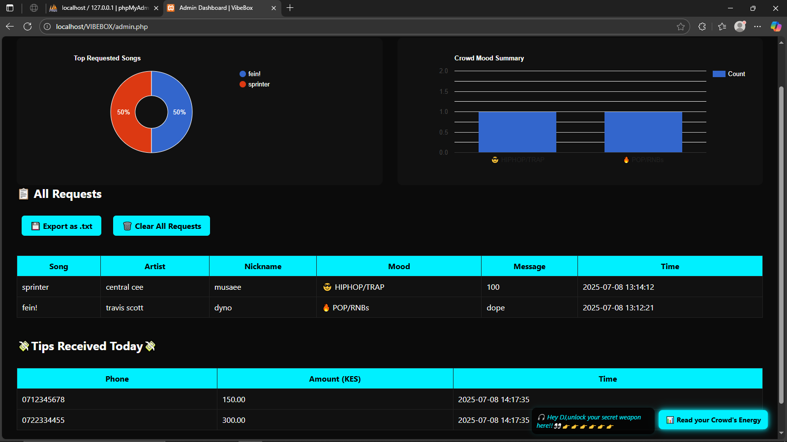

## VIBEBOX---DJ-REQUEST-APP

A Kenyan built DJ Request Web App🎶🎵 with live polling for song voting , song detection feature shazam-like🎙, and live cash tipping to the DJ i.e from MPESA, bank transfers 💰etc, all in one dashboard , this tool is a game changer to help djs  manage their crowd more eficiently in a well organized manner, NO MORE SHOUTING AT THE DJ FOR SONG REQUESTS!!!😊

## ✨ Features
- 📌 **Song Requests** — Guests can request songs live.
- 📊 **Admin Dashboard** — View most requested songs, genres, and tips.
- 💡 **Crowd Mood Polls** — Guests vote on the genre vibe i.e RnB o'clock, Rhumba night etc (results are admin-only).
- 🔍 **What's Playing?** — Uses the **AudD API** to detect the current song.(still under development)
- 💸 **Tip Jar** — Securely send and receive M-PESA tips from the crowd to the dj or club.
- 🛡️ **Spam Protection** — Keeps requests clean and relevant.


## 🖼️ Screenshots

| Home Page | Admin Dashboard | Search Song |
|-----------|----------------|-------------|
|  |  |  |

| Song Request | Tip the DJ | Vote Mood |
|--------------|-----------|-----------|
|  |  |  |

---

## 🛠️ Installation & Setup
1. **Clone the repo**
   ```bash
   git clone (https://github.com/brian-musila/VIBEBOX---DJ-REQUEST-APP.git)
   cd VibeBox

once its cloned, follow the guide to help you you through installing, running, and using the full VibeBox DJ Request Web App on your local machine.

----------------------------------
✅ REQUIREMENTS
----------------------------------
- XAMPP (for PHP + MySQL)
- Web browser (Chrome, Edge, etc.)
- Text editor (VS Code recommended)
- VibeBox project folder (your cloned/downloaded files)

----------------------------------
🧱 STEP 1: Install XAMPP
----------------------------------
1. Go to: https://www.apachefriends.org/index.html
2. Download XAMPP for your operating system.
3. Install it (follow default prompts).
4. Open the XAMPP Control Panel.
5. Start the following services:
   ✅ Apache
   ✅ MySQL

----------------------------------
📦 STEP 2: Place the Project Files
----------------------------------
1. Navigate to the folder:
   C:/xampp/htdocs/
2. Paste the complete VibeBox folder into `htdocs`.

   Example:
   C:/xampp/htdocs/VibeBox-DJ-App/

----------------------------------
🛠️ STEP 3: Set Up the MySQL Database
----------------------------------
1. Open your browser and go to:
   http://localhost/phpmyadmin
2. Click "New" on the left and create a database called:
   vibebox
3. Open the "SQL" tab and paste the following SQL:

   -- Create the requests table:
   CREATE TABLE requests (
     id INT AUTO_INCREMENT PRIMARY KEY,
     song_name VARCHAR(255),
     artist VARCHAR(255),
     nickname VARCHAR(100),
     mood VARCHAR(100),
     message TEXT,
     ip_address VARCHAR(50),
     request_time DATETIME DEFAULT CURRENT_TIMESTAMP
   );

   -- Create the poll votes table:
   CREATE TABLE poll_votes (
     id INT AUTO_INCREMENT PRIMARY KEY,
     mood VARCHAR(100),
     voted_at TIMESTAMP DEFAULT CURRENT_TIMESTAMP
   );

4. Click "Go" to run the script ✅

----------------------------------
🚀 STEP 4: Launch the App
----------------------------------
1. Go to your browser and enter:
   http://localhost/VibeBox-DJ-App/

2. You’ll see the landing page with:
   - 🎧 “What’s Playing?”
   - 🎵 “Make a Request”
   - 📊 “Vote the Vibe”
   - 💰 “Tip the DJ”
   - 🔐 DJ/Admin login

----------------------------------
🔑 ADMIN LOGIN
----------------------------------
- URL: http://localhost/VibeBox-DJ-App/admin-login.php
- Username: dj
- Password: vibebox*
NB//if this doesnt work reach me @mmusilab2@gmail.com //

Admin panel shows:
- Most requested songs
- Mood chart (live crowd vibe)
- Request table

----------------------------------
🎨 EXTRA CUSTOMIZATION
----------------------------------
- Background image: Place your `party4.jpg` in `/assets/`
- Video background (optional): Use `clubloop.mp4` in `/assets/` and modify index.php
- CSS animations and color schemes: Edit `/css/style.css`
